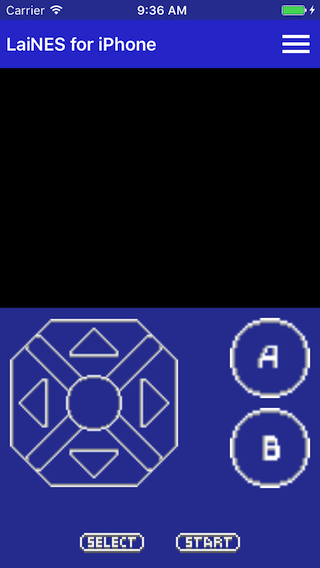
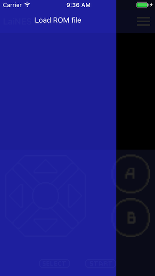

# LaiNES for iOS 
- [LaiNES](https://github.com/suzukiplan/LaiNES) を iOS で動かすようにしてみたものです
- [LICENSE](LICENSE.md)

## Screen shots
 

## How to build
### prerequests
- Xcode 8.2.1

### get start
```
git clone https://github.com/suzukiplan/LaiNES-iOS.git
cd LaiNES-iOS
git submodule init
git submodule update
open LaiNES.xcodeproj
```

